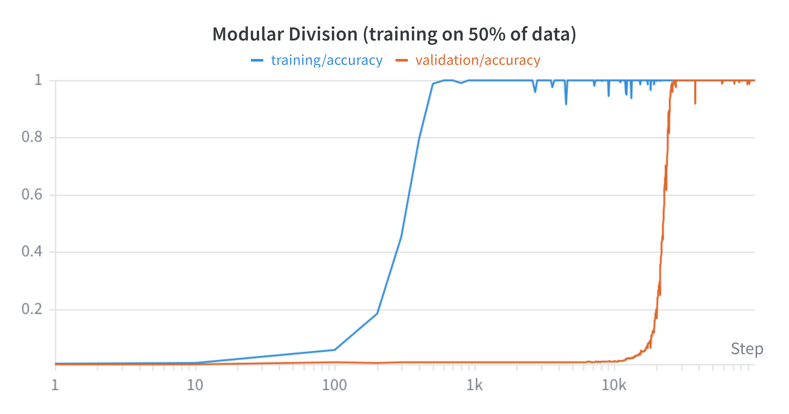

# Grokking

An implementation of the OpenAI 'Grokking: Generalization Beyond Overfitting on Small Algorithmic Datasets' paper in PyTorch.



## Installation

* Clone the repo and cd into it:
    ```bash
    git clone https://github.com/danielmamay/grokking.git
    cd grokking
    ```
* Use Python 3.9 or later:
    ```bash
    conda create -n grokking python=3.9
    conda activate grokking
    pip install -r requirements.txt
    ```

## Usage

The project uses [Weights & Biases](https://wandb.ai/site) to keep track of experiments. Run `wandb login` to use the online dashboard, or `wandb offline` to store the data on your local machine.

* To run a single experiment using the [CLI](grokking/cli.py):
    ```bash
    wandb login
    python grokking/cli.py
    ```

* To run a grid search using W&B Sweeps:
    ```bash
    wandb sweep sweep.yaml
    wandb agent {entity}/grokking/{sweep_id}
    ```

## References

Code:

* [openai/grok](https://github.com/openai/grok)

Paper:

* [Grokking: Generalization Beyond Overfitting on Small Algorithmic Datasets](https://arxiv.org/abs/2201.02177)
