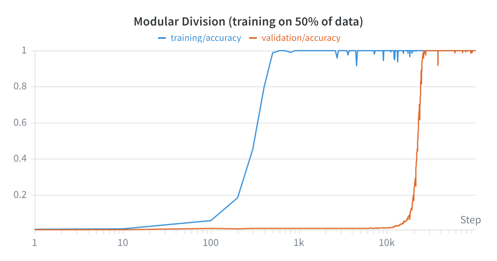
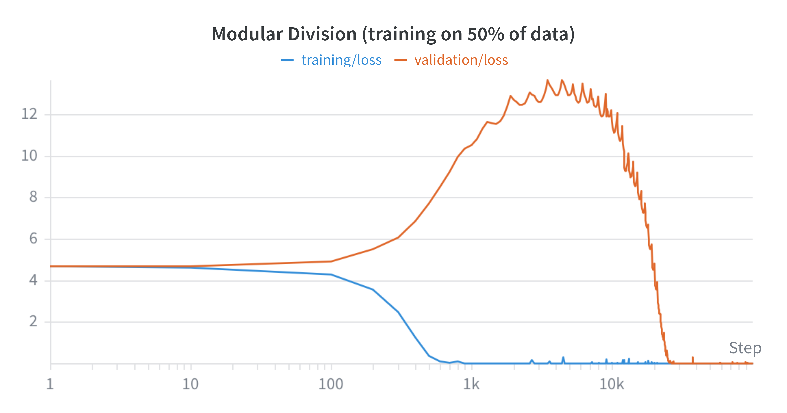

# Grokking

An implementation of the OpenAI 'Grokking: Generalization Beyond Overfitting on Small Algorithmic Datasets' paper in PyTorch.

 

## Installation

* Clone the repo and cd into it:
    ```bash
    git clone https://github.com/danielmamay/grokking.git
    cd grokking
    ```
* Install dependencies:
    ```bash
    uv sync
    ```

## Usage

The project uses [Weights & Biases](https://wandb.ai/site) to keep track of experiments. Run `uv run wandb login` to use the online dashboard, or `uv run wandb offline` to store the data on your local machine.

* To run a single experiment using the [CLI](grokking/cli.py):
    ```bash
    uv run python grokking/cli.py
    ```

* To run a grid search using W&B Sweeps:
    ```bash
    uv run wandb sweep sweep.yaml
    uv run wandb agent {entity}/grokking/{sweep_id}
    ```

## Development

* Type checking:
    ```bash
    uv run pyright grokking/
    ```
* Linting:
    ```bash
    uv run ruff check grokking/
    ```


## References

Code:

* [openai/grok](https://github.com/openai/grok)

Paper:

* [Grokking: Generalization Beyond Overfitting on Small Algorithmic Datasets](https://arxiv.org/abs/2201.02177)
